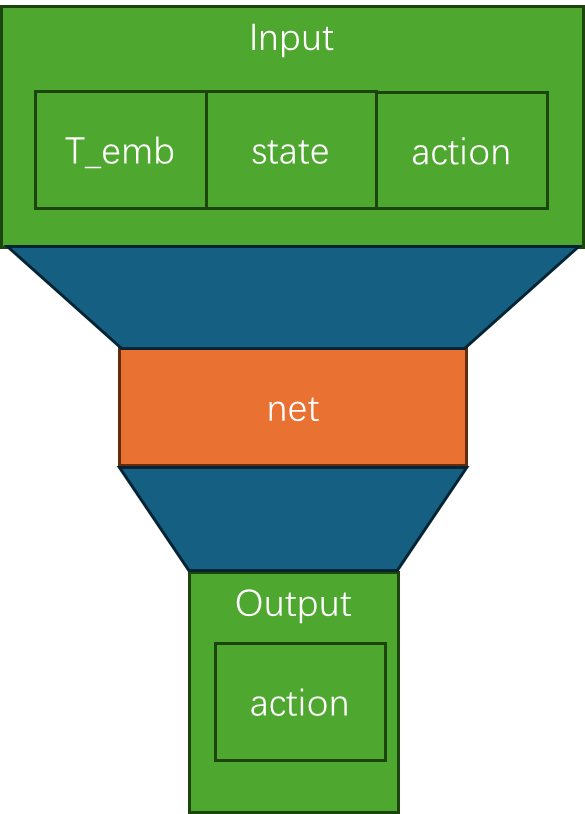
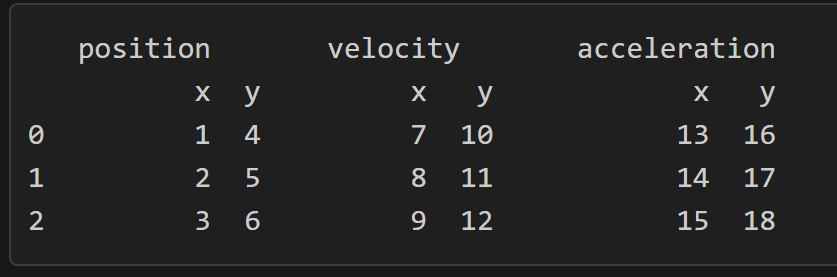

# 自学扩散模型
太有意思了



第一步看科华的代码有没有地图

## 2024 1121
看一下MID的数据处理是怎么处理的

### Process_data
这个代码的主要功能是处理和预处理轨迹数据，并将其保存为 .pkl 文件，以便后续用于训练和评估轨迹预测模型。以下是代码的详细解释：

"""from environment import Environment, Scene, Node, derivative_of"""

定义了一些新的数据结构

为每个数据源和数据类别创建一个 Environment 对象，并设置注意力半径。

遍历原始数据文件夹中的所有 .txt 文件，读取并处理数据。

将数据转换为 Scene 和 Node 对象，并计算速度和加速度。

对训练数据进行数据增强（旋转）

将处理后的场景添加到环境中，并使用 dill 序列化保存为 .pkl 文件。


##### pd.MultiIndex.from_product([['position', 'velocity', 'acceleration'], ['x', 'y']])


是 Pandas 库中的一个方法，用于创建一个多级索引（MultiIndex），其级别是输入序列的笛卡尔积。多级索引允许在一个 DataFrame 中使用多个索引级别，从而可以更灵活地表示和操作数据。

> 举例
假设集合A={a,b}，集合B={0,1,2}，则两个集合的笛卡尔积为{(a,0),(a,1),(a,2),(b,0),(b,1),(b,2)}。类似的例子有，如果A表示某学校学生的集合，B表示该学校所有课程的集合，则A与B的笛卡尔积表示所有可能的选课情况。
> 应用
在数据库中，笛卡尔积常用于描述两个表之间所有可能的配对情况。当在查询中连接两个表时，如果没有指定适当的连接条件，就可能产生笛卡尔积，这通常会导致非常庞大的结果集。


## Training 
For example, train with 8 GPUs: 
```
cd tools

bash scripts/dist_train.sh 8 --cfg_file cfgs/waymo/mtr+100_percent_data.yaml --batch_size 80 --epochs 30 --extra_tag my_first_exp
```
Actually, during the training process, the evaluation results will be logged to the log file under `output/waymo/mtr+100_percent_data/my_first_exp/log_train_xxxx.txt`

## Testing
For example, test with 8 GPUs: 
```
cd tools
bash scripts/dist_test.sh 8 --cfg_file cfgs/waymo/mtr+100_percent_data.yaml --ckpt ../output/waymo/mtr+100_percent_data/my_first_exp/ckpt/checkpoint_epoch_30.pth --extra_tag my_first_exp --batch_size 80 
```


waymo 数据集的表头
dict_keys(['track_infos', 'dynamic_map_infos', 'map_infos', 'scenario_id', 'timestamps_seconds', 'current_time_index', 'sdc_track_index', 'objects_of_interest', 'tracks_to_predict'])


检查 HDMap 数据：

如果配置中没有设置 WITHOUT_HDMAP 或者其值为 False，则继续处理 HDMap 数据。
检查 info['map_infos']['all_polylines'] 是否为空。如果为空，则用形状为 (2, 7) 的零数组填充，并打印警告信息。
创建地图数据：

调用 self.create_map_data_for_center_objects 方法，为中心对象创建地图数据。该方法返回三个值：map_polylines_data、map_polylines_mask 和 map_polylines_center。
map_polylines_data：形状为 (num_center_objects, num_topk_polylines, num_points_each_polyline, 9) 的数组，表示中心对象的地图折线数据。
map_polylines_mask：形状为 (num_center_objects, num_topk_polylines, num_points_each_polyline) 的布尔掩码数组。
map_polylines_center：中心对象的地图折线中心数据。
更新返回字典：

将 map_polylines_data、map_polylines_mask 和 map_polylines_center 添加到返回字典 ret_dict 中。
map_polylines_mask 被转换为布尔值，表示哪些折线是有效的。
总结来说，这段代码在处理 Waymo 数据集时，检查并处理 HDMap 数据，为中心对象创建地图折线数据，并将这些数据添加到返回字典中。


这个字典 ret_dict 包含了在模型训练过程中使用的各种数据。以下是每一项的解释及其在模型训练中的用途：

scenario_id:

解释: 一个包含场景ID的数组，长度与 track_index_to_predict 相同。
用途: 用于标识每个轨迹所属的场景。
obj_trajs:

解释: 对象轨迹数据。
用途: 用于训练模型预测对象的轨迹。
obj_trajs_mask:

解释: 对象轨迹的掩码。
用途: 用于指示哪些轨迹数据是有效的。
track_index_to_predict:

解释: 需要预测的轨迹索引。
用途: 用于选择中心特征。
obj_trajs_pos:

解释: 对象轨迹的位置数据。
用途: 用于训练模型预测对象的位置。
obj_trajs_last_pos:

解释: 对象轨迹的最后位置数据。
用途: 用于提供对象的最后已知位置。
obj_types:

解释: 对象类型。
用途: 用于区分不同类型的对象。
obj_ids:

解释: 对象ID。
用途: 用于唯一标识每个对象。
center_objects_world:

解释: 中心对象的世界坐标。
用途: 用于提供中心对象的位置信息。
center_objects_id:

解释: 中心对象的ID。
用途: 用于唯一标识中心对象。
center_objects_type:

解释: 中心对象的类型。
用途: 用于区分不同类型的中心对象。
obj_trajs_future_state:

解释: 对象轨迹的未来状态。
用途: 用于训练模型预测对象的未来状态。
obj_trajs_future_mask:

解释: 对象轨迹未来状态的掩码。
用途: 用于指示哪些未来状态数据是有效的。
center_gt_trajs:

解释: 中心对象的真实轨迹。
用途: 用于提供中心对象的真实轨迹数据，作为模型训练的目标。
center_gt_trajs_mask:

解释: 中心对象真实轨迹的掩码。
用途: 用于指示哪些真实轨迹数据是有效的。
center_gt_final_valid_idx:

解释: 中心对象真实轨迹的最后有效索引。
用途: 用于指示中心对象真实轨迹的最后一个有效点。
center_gt_trajs_src:

解释: 中心对象的完整轨迹数据。
用途: 用于提供中心对象的完整轨迹数据，作为模型训练的参考。


#### create_map_data_for_center_objects
这个函数 create_map_data_for_center_objects 的主要目的是为中心对象生成地图数据。以下是该函数的详细解释：

输入参数:

center_objects: 中心对象的坐标和其他信息。
map_infos: 地图信息，包括所有多段线数据。
center_offset: 中心偏移量。
步骤:

定义内部函数 transform_to_center_coordinates:

该函数将多段线坐标转换到中心对象的坐标系中。
通过减去中心对象的坐标并旋转点来实现。
生成前一个点的坐标并将其添加到多段线特征中。
使用掩码将无效的多段线数据置零。
转换输入数据为张量:

将 map_infos 中的多段线数据和 center_objects 转换为 PyTorch 张量。
生成批量多段线数据:

使用 generate_batch_polylines_from_map 函数生成批量多段线数据和掩码。
选择每个中心对象的最近多段线:

如果多段线数量超过阈值 num_of_src_polylines，则选择最近的多段线。
计算多段线中心和地图中心的距离，选择最近的多段线。
否则，重复多段线数据以匹配中心对象的数量。
转换多段线坐标到中心对象坐标系:

使用内部函数 transform_to_center_coordinates 将多段线坐标转换到中心对象的坐标系中。
计算多段线中心:

计算每个多段线的中心坐标。
转换结果为 NumPy 数组:

将结果从 PyTorch 张量转换为 NumPy 数组。
返回值:

map_polylines: 转换后的多段线数据。
map_polylines_mask: 多段线掩码。
map_polylines_center: 多段线中心坐标。
这个函数的主要作用是为每个中心对象生成与其相关的地图多段线数据，并将这些多段线数据转换到中心对象的坐标系中，以便在后续的模型训练或预测过程中使用。